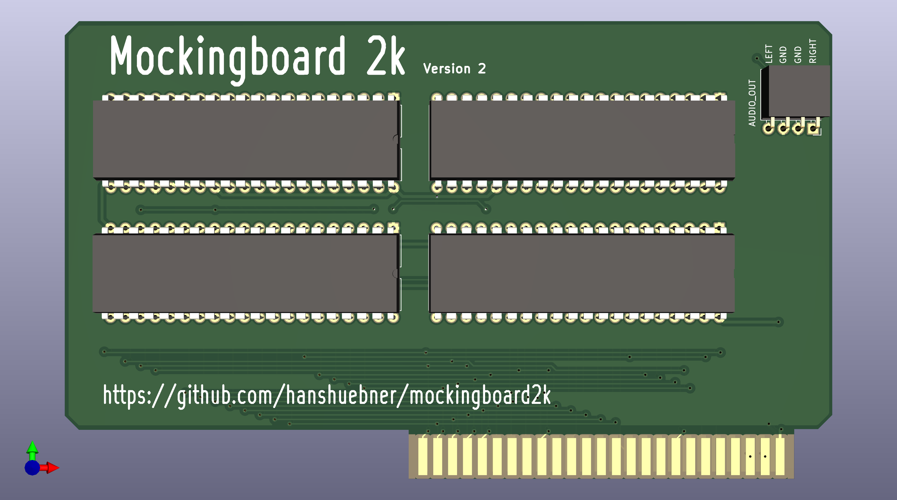
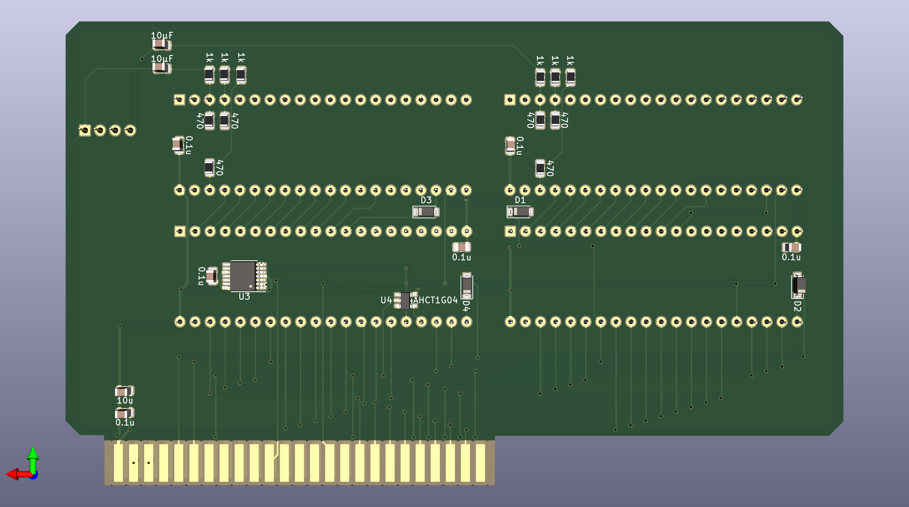

# mockingboard2k - Mockingboard compatible Apple II sound card

This Mockingboard clone uses SMD parts for all modern components.

Please make sure that you're using 6522A VIAs.  6522 chips often don't work
with the Phi2 generation circuit that is present on this board.

